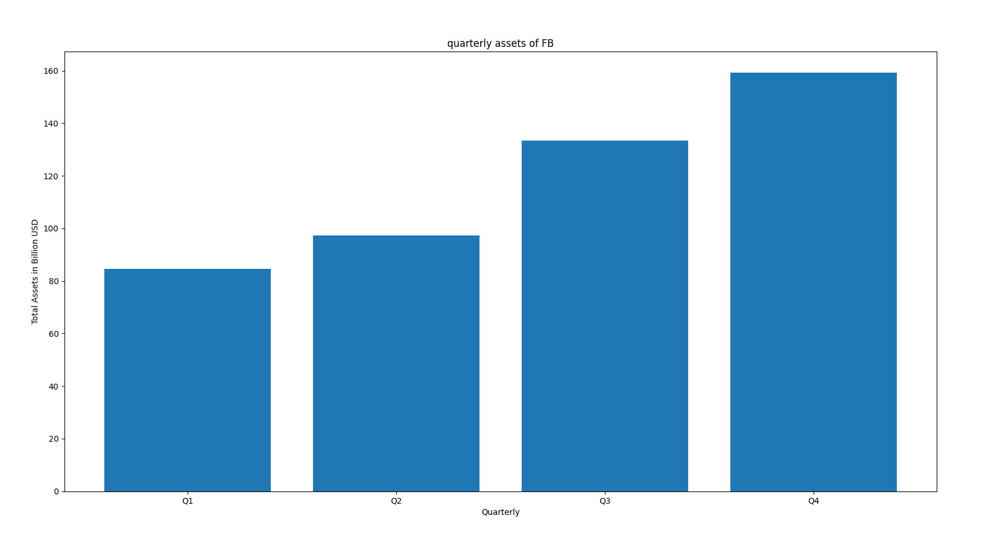

## Balance sheet analysis

This app uses the Financial Modeling Prep API to retrieve accurate financial data from the stock market. In the queries.py document we're able to query for different data we seek from the api, and the main.py uses the matplotlib library to plot the quarterly points of a given company. It gives the total asset value in billion dollars for the company. 

  

## How it works
We can input the name of the company we're trying to query for in the company variable. We can also assign the number of years we seek to retrieve data for in the years variable. The program then outputs the most recent value (index 0) for the given query. In main.py, similar to queries.py, we assign a company and number of years we want to see data for. It then retrieves the total quarterly assets for the company. 
